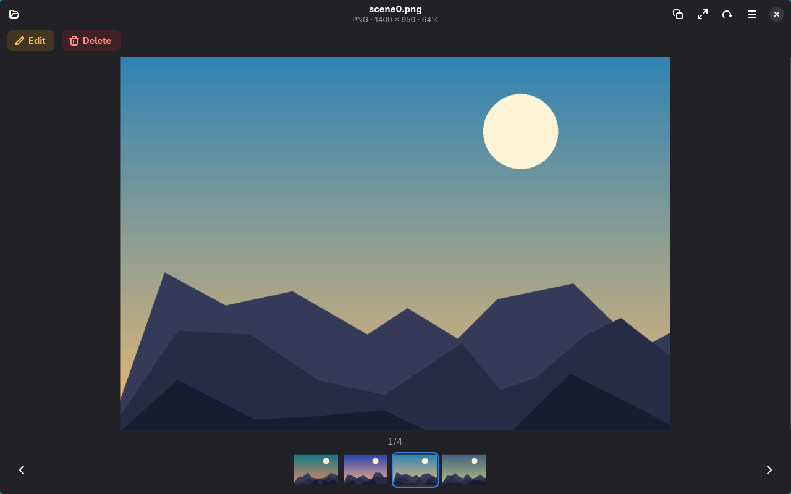

<div align="center">


# Glance

**A fast, native image viewer for Linux.**

It opens a file, shows it properly, and gets out of the way.

</div>



## What it is

An image viewer first: photographs, screenshots, vector art and camera raw all open in
the same window, and browsing a folder is a matter of pressing an arrow key.

When you do need to change something, the editor is one button away — crop, resize,
rotate, adjust the colour, draw on it, add text, convert it to another format, or squeeze
it down to a file size someone asked for.

## Why

Most Linux image viewers are either fast but dated, or modern-looking but sluggish for
what is fundamentally a pixel-blitting problem. Glance aims at both: a GNOME-native
window that starts instantly and stays smooth on a 50-megapixel photograph.

Three decisions follow from that:

- **Rust**, because an image viewer is a parser for untrusted binary data. Image decoders
  are a classic source of memory-corruption bugs — libjpeg, libpng and WebP have all had
  serious ones. Rust removes that whole class of defect from the decoding path.
- **The GPU does the drawing.** Zooming and panning are transforms, not re-renders. Where
  an SVG maps onto GTK's own render nodes it is translated into them once at load, so
  zooming never re-rasterises anything. On one logo with three nested drop shadows,
  zooming to 23× cost 571 MB and 11.6 s through a rasteriser, and 0 MB and 1.0 s this way.
- **Colour is handled once, at the door.** Every decoder converts to 8-bit sRGB before
  the picture reaches anything else, so a pixel means the same thing in the tone sliders,
  under the text and drawings, and on the way back out to a file.

Decoding never runs on the main thread, so a huge file cannot freeze the window.

## Features

**Viewing** — fit to window, 100%, free zoom to 32×. Zoom anchors on the pointer, so the
pixel under the cursor stays under it. Two fingers on a touchpad pan and the wheel zooms —
the hardware says which is which, so there is no modifier to remember. Pinch works too.
Animated GIF and WebP play, and keep playing while you zoom or rotate.

**Browsing** — a filmstrip of the folder along the bottom, arrow keys to step through it,
and the folder is watched so files added elsewhere show up.

**Editing** — one panel, one section at a time:

| Section | What it does |
|---|---|
| **Rotate & Flip** | Quarter turns, or any angle typed into the box. A separate header button turns the picture 90° just to look at it, without changing the file |
| **Crop** | Drag a rectangle, pull any of its eight handles, or pick an aspect preset |
| **Resize** | Handles on the picture or numbers in the panel, kept in step, with an optional aspect lock |
| **Adjust** | Brightness, contrast and saturation, applied live on the GPU and baked identically on save |
| **Draw** | Pen, highlighter, line, arrow, rectangle, ellipse — with the buttons drawing their own shapes |
| **Text** | Font, size, colour, background, bold, italic, underline, dragged anywhere |
| **Export** | Any format the picture can honestly become, with a quality dial — or a file size to aim for |

That last one is the unusual bit: give it a number and it will compress *or* inflate the
file to hit it, which is what people normally hand to a shady upload site to get done.

Nothing is written until you say so, and saving over the original asks first.

**Formats**

| Family | Formats |
|---|---|
| Raster | PNG, JPEG, GIF, WebP, TIFF, BMP, ICO, QOI, TGA, PNM |
| Modern | HEIC / HEIF, AVIF |
| Vector | SVG, SVGZ |
| Camera raw | CR2, CR3, CRW, NEF, NRW, ARW, DNG, RAF, ORF, RW2, PEF, SRW, and 14 more |

EXIF orientation is honoured, so phone photos are upright. So are ICC profiles: an Adobe
RGB or Display P3 photograph is converted to sRGB on the way in rather than shown as
though its numbers meant something else. About 27 ms on a 12-megapixel photograph;
recognising an already-sRGB profile and skipping it costs 2 µs.

## How it compares

Against the image viewers people actually use on Linux. Compiled from each project's own
documentation in September 2026 — features move, so check upstream if one matters to you.

<table>
<tr>
<th align="left">Speed and rendering</th>
<th align="center"><br>Glance</th>
<th align="center"><br>Loupe</th>
<th align="center"><br>gThumb</th>
<th align="center"><br>Gwenview</th>
<th align="center"><br>qView</th>
<th align="center"><br>nomacs</th>
</tr>
<tr><td>GPU-accelerated rendering</td><td align="center">✅</td><td align="center">✅</td><td align="center">❌</td><td align="center">❌</td><td align="center">❌</td><td align="center">❌</td></tr>
<tr><td>SVG zoom with no re-rasterising</td><td align="center">✅</td><td align="center">❌</td><td align="center">❌</td><td align="center">❌</td><td align="center">❌</td><td align="center">❌</td></tr>
<tr><td>Memory-safe decoders (Rust)</td><td align="center">✅</td><td align="center">✅</td><td align="center">❌</td><td align="center">❌</td><td align="center">❌</td><td align="center">❌</td></tr>
<tr><td>Two-finger pan and pinch zoom</td><td align="center">✅</td><td align="center">✅</td><td align="center">❌</td><td align="center">❌</td><td align="center">❌</td><td align="center">❌</td></tr>
<tr><td>Modern toolkit (GTK 4 / libadwaita)</td><td align="center">✅</td><td align="center">✅</td><td align="center">❌</td><td align="center">❌</td><td align="center">❌</td><td align="center">❌</td></tr>
</table>

<table>
<tr>
<th align="left">Editing</th>
<th align="center"><br>Glance</th>
<th align="center"><br>Loupe</th>
<th align="center"><br>gThumb</th>
<th align="center"><br>Gwenview</th>
<th align="center"><br>qView</th>
<th align="center"><br>nomacs</th>
</tr>
<tr><td>Rotate and flip</td><td align="center">✅</td><td align="center">✅</td><td align="center">✅</td><td align="center">✅</td><td align="center">✅</td><td align="center">✅</td></tr>
<tr><td>Rotate to any angle</td><td align="center">✅</td><td align="center">❌</td><td align="center">✅</td><td align="center">❌</td><td align="center">❌</td><td align="center">✅</td></tr>
<tr><td>Crop</td><td align="center">✅</td><td align="center">✅</td><td align="center">✅</td><td align="center">✅</td><td align="center">❌</td><td align="center">✅</td></tr>
<tr><td>Resize to exact pixels</td><td align="center">✅</td><td align="center">❌</td><td align="center">✅</td><td align="center">✅</td><td align="center">❌</td><td align="center">✅</td></tr>
<tr><td>Brightness / contrast / saturation</td><td align="center">✅</td><td align="center">❌</td><td align="center">✅</td><td align="center">✅</td><td align="center">❌</td><td align="center">✅</td></tr>
<tr><td>Draw, shapes and text on the image</td><td align="center">✅</td><td align="center">❌</td><td align="center">❌</td><td align="center">✅</td><td align="center">❌</td><td align="center">✅</td></tr>
<tr><td>Convert format on save, with a quality dial</td><td align="center">✅</td><td align="center">❌</td><td align="center">✅</td><td align="center">✅</td><td align="center">❌</td><td align="center">✅</td></tr>
<tr><td><strong>Compress or inflate to a target file size</strong></td><td align="center">✅</td><td align="center">❌</td><td align="center">❌</td><td align="center">❌</td><td align="center">❌</td><td align="center">❌</td></tr>
</table>

<table>
<tr>
<th align="left">Browsing and extras</th>
<th align="center"><br>Glance</th>
<th align="center"><br>Loupe</th>
<th align="center"><br>gThumb</th>
<th align="center"><br>Gwenview</th>
<th align="center"><br>qView</th>
<th align="center"><br>nomacs</th>
</tr>
<tr><td>Camera raw, HEIC / AVIF and SVG</td><td align="center">✅</td><td align="center">✅</td><td align="center">✅</td><td align="center">✅</td><td align="center">✅</td><td align="center">✅</td></tr>
<tr><td>ICC colour management</td><td align="center">✅</td><td align="center">✅</td><td align="center">✅</td><td align="center">✅</td><td align="center">✅</td><td align="center">❌</td></tr>
<tr><td>Filmstrip of the folder</td><td align="center">✅</td><td align="center">❌</td><td align="center">✅</td><td align="center">✅</td><td align="center">❌</td><td align="center">✅</td></tr>
<tr><td>Thumbnail browser / file manager</td><td align="center">❌</td><td align="center">❌</td><td align="center">✅</td><td align="center">✅</td><td align="center">❌</td><td align="center">✅</td></tr>
<tr><td>EXIF / metadata panel</td><td align="center">❌</td><td align="center">✅</td><td align="center">✅</td><td align="center">✅</td><td align="center">❌</td><td align="center">✅</td></tr>
<tr><td>Slideshow</td><td align="center">❌</td><td align="center">❌</td><td align="center">✅</td><td align="center">✅</td><td align="center">✅</td><td align="center">✅</td></tr>
<tr><td>Batch processing</td><td align="center">❌</td><td align="center">❌</td><td align="center">✅</td><td align="center">❌</td><td align="center">❌</td><td align="center">✅</td></tr>
<tr><td>Tags, catalogs, albums</td><td align="center">❌</td><td align="center">❌</td><td align="center">✅</td><td align="center">❌</td><td align="center">❌</td><td align="center">❌</td></tr>
<tr><td>Windows and macOS builds</td><td align="center">❌</td><td align="center">❌</td><td align="center">❌</td><td align="center">❌</td><td align="center">✅</td><td align="center">✅</td></tr>
</table>

Icons are each project's own, from their Flathub listings, used to identify them.

**The short version.** Glance is the fastest and the most capable editor of the six, and
the only one that can hit a file size on request. It is not a photo library: if you want
tags, catalogs, batch jobs or a camera import wizard, gThumb is still the answer, and
nomacs if you need Windows too. Loupe is the closest in spirit — same toolkit, same
language — but stops at crop and rotate.

## Installing

Two ways in. **From source** is the short one if your distribution is recent enough;
**Flatpak** works anywhere, because GTK, libadwaita and libheif come from the GNOME
runtime instead of from your system.

### From source

**1. Install what it builds against.** GTK 4.14 and libadwaita 1.5 or newer — the
versions in Ubuntu 24.04 LTS, so anything that recent will do — plus libheif for HEIC and
AVIF, Rust, and `make`. Everything else is pure Rust and comes in through Cargo.

```bash
sudo pacman -S gtk4 libadwaita libheif rust make                        # Arch
sudo dnf install gtk4-devel libadwaita-devel libheif-devel cargo make   # Fedora
sudo apt install libgtk-4-dev libadwaita-1-dev libheif-dev cargo make   # Debian, Ubuntu
```

**2. Get the source.**

```bash
git clone https://github.com/ABHILESH1412/glance.git
cd glance
```

**3. Build and install.** The first build takes a few minutes; it is compiling every
dependency once.

```bash
make                       # cargo build --release
sudo make install          # into /usr/local
```

Use `sudo make install PREFIX=/usr` if you would rather it went where your package
manager puts things. `make install` also places the desktop entry, the icons and the
AppStream metainfo — without those the program runs but never appears in a launcher or as
a handler for a JPEG. Packagers: `DESTDIR` works as usual and the icon and desktop caches
are left alone when it is set.

**4. Run it.** `glance` is now on your path, and Glance is in your launcher and in the
"Open With" menu for images.

```bash
glance path/to/image.jpg
```

To remove it again:

```bash
sudo make uninstall
```

### Flatpak

**1. Install the build tool, and the runtime it builds against.** The runtime is about a
gigabyte and is shared with every other GNOME Flatpak you have.

```bash
sudo pacman -S flatpak flatpak-builder                    # Arch
sudo dnf install flatpak flatpak-builder                  # Fedora
sudo apt install flatpak flatpak-builder                  # Debian, Ubuntu

flatpak remote-add --if-not-exists --user \
    flathub https://dl.flathub.org/repo/flathub.flatpakrepo
flatpak install --user flathub \
    org.gnome.Platform//49 \
    org.gnome.Sdk//49 \
    org.freedesktop.Sdk.Extension.rust-stable//25.08
```

**2. Get the source.**

```bash
git clone https://github.com/ABHILESH1412/glance.git
cd glance
```

**3. Build and install.** This builds the checkout you are standing in, so there is
nothing to tag or push first.

```bash
flatpak-builder --user --install --force-clean build-dir \
    build-aux/io.github.abhilesh1412.Glance.yaml
```

**4. Run it.**

```bash
flatpak run io.github.abhilesh1412.Glance path/to/image.jpg
```

To remove it again:

```bash
flatpak uninstall --user io.github.abhilesh1412.Glance
```

<details>
<summary>If you change the dependencies</summary>

Flatpak builds with the network switched off, so every crate has to be declared in
advance. [`build-aux/cargo-sources.json`](build-aux/cargo-sources.json) is that list, and
it is checked in — you only need to regenerate it if `Cargo.lock` changes:

```bash
curl -O https://raw.githubusercontent.com/flatpak/flatpak-builder-tools/master/cargo/flatpak-cargo-generator.py

# In a virtual environment, since most distributions now refuse `pip install`
# into the system Python.
python3 -m venv /tmp/fcg
/tmp/fcg/bin/pip install aiohttp PyYAML tomlkit
/tmp/fcg/bin/python flatpak-cargo-generator.py Cargo.lock -o build-aux/cargo-sources.json
```

</details>

## Development

`make` wraps `cargo build --release`, but a release link takes minutes because of LTO.
There is a `quick` profile for day-to-day work — optimised, without the LTO — which you
want for anything involving camera raw or SVG, since both are unusably slow in a debug
build.

```bash
cargo run --profile quick -- path/to/image.jpg
```

```bash
cargo test     # unit tests
make check     # those, plus desktop-entry and AppStream validation
```

`make check` runs the same validation a distribution or Flathub will run on the way in.
[`testdata/`](testdata/README.md) holds fixtures chosen to catch specific mistakes — an
EXIF-rotated JPEG, a transparent SVG that exposes premultiplied-alpha errors, a corrupt
file, and four CC0 camera raws covering different decode paths.

## Keyboard shortcuts

| Key | Action |
|---|---|
| `Ctrl+O` | Open an image |
| `←` `→` `Space` | Previous / next image |
| `+` `-` `0` `1` | Zoom in, out, fit, 100% |
| `[` `]` | Rotate left / right |
| `Ctrl+E` | Edit panel |
| `Ctrl+T` `Ctrl+R` | Rotate and flip / Resize |
| `Ctrl+Z` `Ctrl+Shift+Z` | Undo / redo an edit |
| `Ctrl+S` `Ctrl+Shift+S` | Save in place / Export… |
| `Ctrl+C` | Copy the image to the clipboard |
| `F11` | Fullscreen |
| `Delete` | Delete the current image |
| `Esc` | Leave fullscreen, close the panel, or cancel editing |
| `Ctrl+W` `Ctrl+Q` | Close window / quit |

## Known limitations

- **SVG is not an export format.** An SVG can be written out as pixels at any size, but
  pixels cannot be turned back into shapes. To keep an SVG an SVG, copy the file.
- Text and drawings are placed against the picture's current size. Resizing carries them
  along; a crop or rotation applied afterwards will not move them for you.
- Exporting an animated GIF or WebP writes the frame you are looking at.
- "Move to Bin" needs a filesystem that has one. From `/tmp` or some removable media it
  reports that it is unsupported; **Delete Permanently** still works there.

Wanted, but not built yet: HDR and wide-gamut output, and progressive loading so a 100 MP
TIFF appears in stages.

## Licence

GPL-3.0-or-later — see [LICENSE](LICENSE). You may use, study, change and share this
program; a changed version you distribute has to stay open under the same terms.
